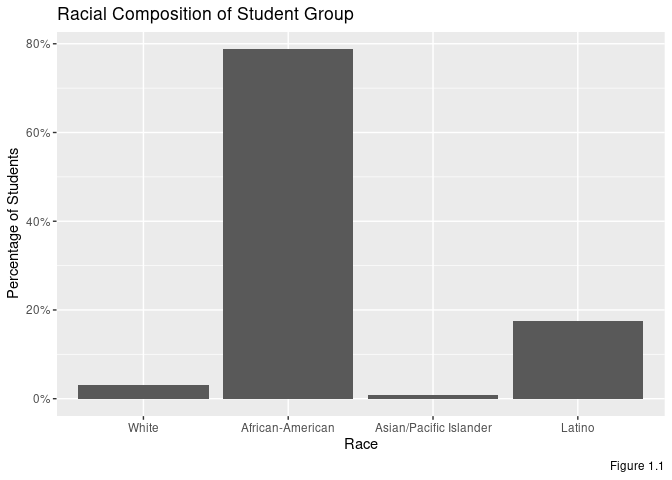
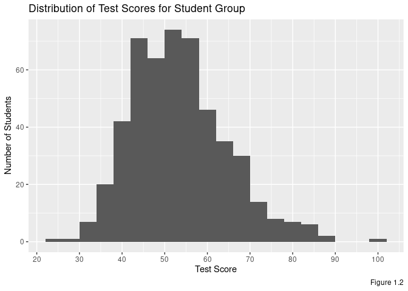
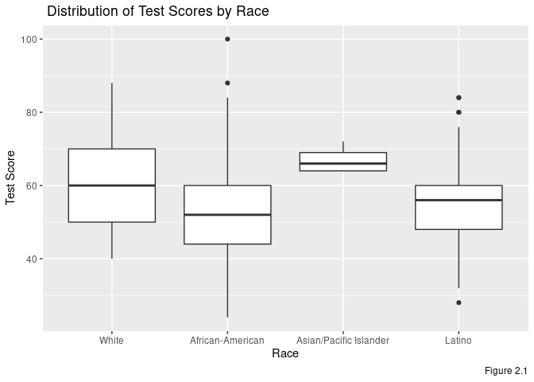
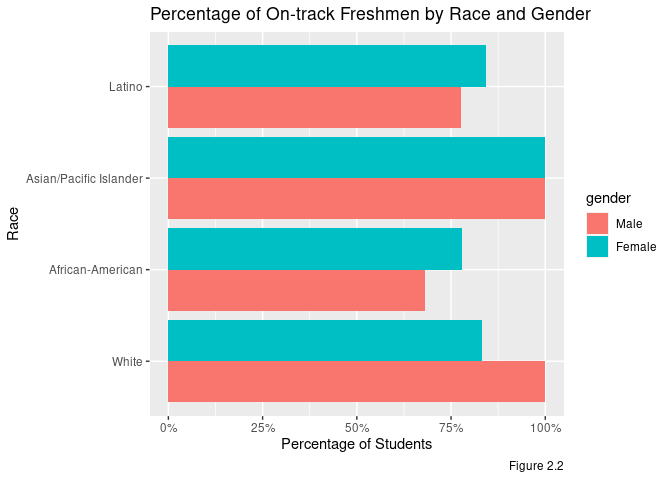
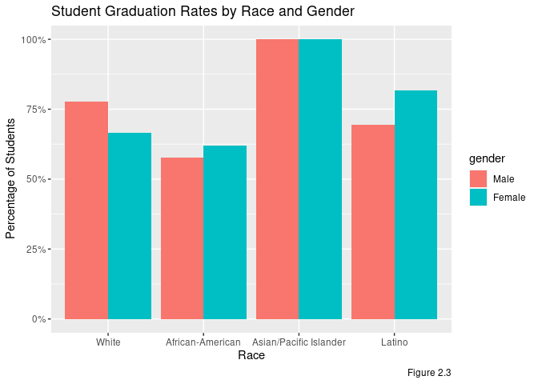
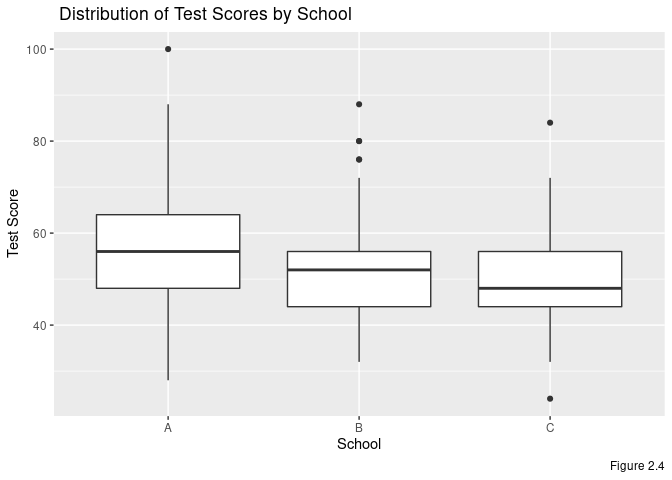
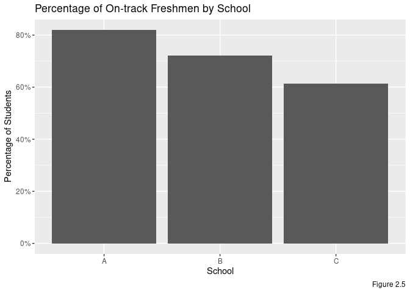
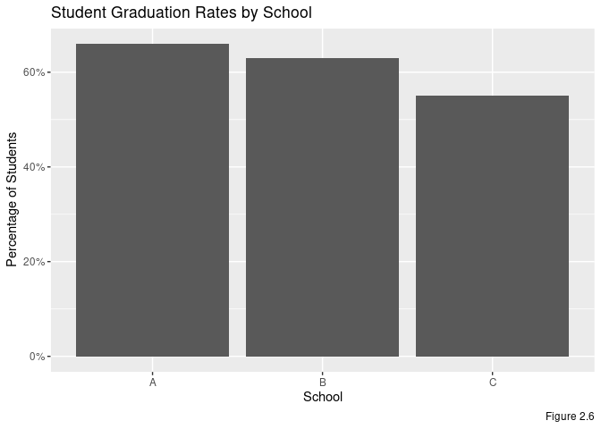
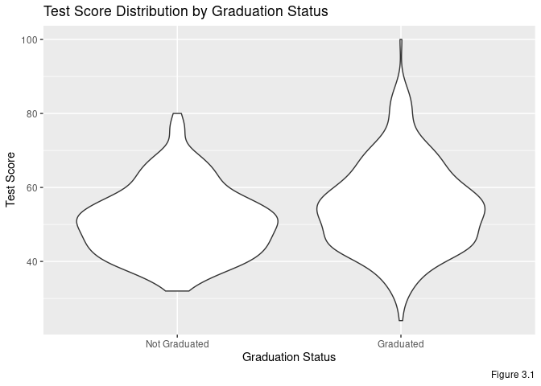
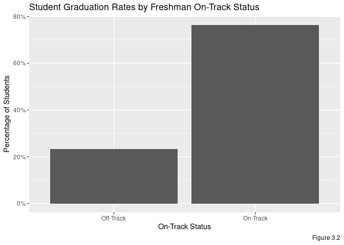

Homework 06
================
Dylan Petiprin
2/21/2021

  - [Overview](#overview)
  - [Part One: The Student Sample and Their
    Outcomes](#part-one-the-student-sample-and-their-outcomes)
  - [Part Two: Student Outcomes by
    Demographic](#part-two-student-outcomes-by-demographic)
  - [Part 3: Predicting High School
    Graduation](#part-3-predicting-high-school-graduation)

## Overview

Increasing high school graduation rates is a primary goal for many
education policy researchers and practitioners. By identifying students
early in high school that are at-risk for dropping out, school districts
can implement targeted interventions designed to increase graduation
rates. This analysis tests whether 9th grade test scores or
freshman-on-track–a binary indicator of whether a freshman has passed
all their core classes and accrued enough credits to move on to
sophomore year–is a better predictor of whether students will end up
graduating.

## Part One: The Student Sample and Their Outcomes

<table class="table" style="margin-left: auto; margin-right: auto;">

<caption>

Table 1: Free or Reduced Lunch

</caption>

<thead>

<tr>

<th style="text-align:right;">

Percent Free or Reduced Lunch

</th>

</tr>

</thead>

<tbody>

<tr>

<td style="text-align:right;">

95.2

</td>

</tr>

</tbody>

</table>

<table class="table" style="margin-left: auto; margin-right: auto;">

<caption>

Table 2: Gender Breakdown of Student Sample

</caption>

<thead>

<tr>

<th style="text-align:left;">

Gender

</th>

<th style="text-align:right;">

Number of Students

</th>

<th style="text-align:right;">

Percentage of Total Students

</th>

</tr>

</thead>

<tbody>

<tr>

<td style="text-align:left;">

Male

</td>

<td style="text-align:right;">

253

</td>

<td style="text-align:right;">

50.6

</td>

</tr>

<tr>

<td style="text-align:left;">

Female

</td>

<td style="text-align:right;">

247

</td>

<td style="text-align:right;">

49.4

</td>

</tr>

</tbody>

</table>

<!-- -->

<table class="table" style="margin-left: auto; margin-right: auto;">

<caption>

Table 3: Student Totals by Race

</caption>

<thead>

<tr>

<th style="text-align:left;">

Race

</th>

<th style="text-align:right;">

Number of Students

</th>

</tr>

</thead>

<tbody>

<tr>

<td style="text-align:left;">

White

</td>

<td style="text-align:right;">

15

</td>

</tr>

<tr>

<td style="text-align:left;">

African-American

</td>

<td style="text-align:right;">

394

</td>

</tr>

<tr>

<td style="text-align:left;">

Asian/Pacific Islander

</td>

<td style="text-align:right;">

4

</td>

</tr>

<tr>

<td style="text-align:left;">

Latino

</td>

<td style="text-align:right;">

87

</td>

</tr>

</tbody>

</table>

<table class="table" style="margin-left: auto; margin-right: auto;">

<caption>

Table 4: Student Attainment Indicators

</caption>

<thead>

<tr>

<th style="text-align:right;">

Percent on Track

</th>

<th style="text-align:right;">

Percent Graduated

</th>

<th style="text-align:right;">

Average Test Score

</th>

</tr>

</thead>

<tbody>

<tr>

<td style="text-align:right;">

75.2

</td>

<td style="text-align:right;">

63.2

</td>

<td style="text-align:right;">

53.384

</td>

</tr>

</tbody>

</table>

<table class="table" style="margin-left: auto; margin-right: auto;">

<caption>

Table 5: Student Totals by School

</caption>

<thead>

<tr>

<th style="text-align:left;">

School

</th>

<th style="text-align:right;">

Number of Students

</th>

<th style="text-align:right;">

Percentage of Total Students

</th>

</tr>

</thead>

<tbody>

<tr>

<td style="text-align:left;">

A

</td>

<td style="text-align:right;">

244

</td>

<td style="text-align:right;">

48.8

</td>

</tr>

<tr>

<td style="text-align:left;">

B

</td>

<td style="text-align:right;">

176

</td>

<td style="text-align:right;">

35.2

</td>

</tr>

<tr>

<td style="text-align:left;">

C

</td>

<td style="text-align:right;">

80

</td>

<td style="text-align:right;">

16.0

</td>

</tr>

</tbody>

</table>

<!-- -->

Nearly all students in this sample qualify as low-income, with 95.2% of
students receiving free or reduced-price lunch (Table 1). These students
are predominately people of color, with approximately 80% being
African-American and 17% being Latino (Figure 1.1). The gender ratio
between male and female students is very close to 1:1 (Table 2). School
A is the most represented, making up nearly half of the sample, followed
by schools B and C, respectively (Table 5).

Regarding attainment indicators, 75.2% of freshmen in the sample were
considered to be on-track. A majority (63.2%) of students went on to
attain a high school diploma within 4 years of starting high school, and
the average 9th grade test score was approximately 53.4 (Table 4). The
distribution of 9th grade test scores is unimodal and shows a slightly
positive skew (Figure 1.2).

Overall, this student sample is mainly composed of Black and Latino
low-income students, the majority of whom were on track to graduate in
9th grade and ended up doing so.

## Part Two: Student Outcomes by Demographic

**Note:** Given the small number of White (n = 15) and Asian/Pacific
Islander (n = 4) students in the sample, there’s reason to believe that
many of the following graphs don’t provide representative insights for
these two groups.

<!-- -->

<!-- -->

<!-- -->

<!-- -->

<!-- -->

<!-- -->

Median 9th grade test scores increase from African-American, to Latino,
to White, to Asian/Pacific Islander. African-American students have the
greatest range in test scores, which is perhaps unsurprising given that
they make up nearly 80% of the sample (Figure 2.1). Students from School
A seem to generally have higher test scores than those from schools B
and C. While students from School B have a higher median test score than
those from School C, the two schools have approximately the same
interquartile range, indicating that many of their students are scoring
similarly (Figure 2.4).

Freshman on-track rates follow a similar pattern, with rates increasing
from African-American, to Latino, to White, to Asian/Pacific
Islander(Figure 2.2), and decreasing from schools A to B to C (Figure
2.6). For African-American and Latino groups, for which we have the
greatest number of students, female students seem to score about 10
percentage points higher than their male peers for on-track status.
White students are the only group for which we find males exceeding
their female peers in freshman on-track status (Figure 2.2).

The data on graduation rates by race show Latino female students
graduating at higher rates than both male and female White students, and
Latino male students graduating at higher rates than White female
students. For African-American and Latino students, female graduation
rates are greater than those of male (Figure 2.3). As with the
ninth-grade test scores and on-track status, rates for graduation by
school descend from A to B to C (Figure 2.6).

## Part 3: Predicting High School Graduation

<!-- --><!-- -->

Looking at Figure 3.1, we see that students who graduate show a greater
range in 9th grade test scores. However, the majority of students in
both groups seem to have nearly the same scores on average.

Compare this to Figure 3.2, where we find students who are on-track as
freshmen seem to graduate by over 50 percentage points more than their
off-track peers. This indicates that freshman on-track status is a much
better predictor of high school graduation than 9th grade test scores.
Let’s run some regressions to see if they support this conjecture.

### Regression One: Graduation on Test Scores, Controlling for Demographics

<table class="table table-striped table-hover table-condensed table-responsive" style="width: auto !important; margin-left: auto; margin-right: auto;">

<tbody>

<tr>

<td style="text-align:left;font-weight: bold;">

Observations

</td>

<td style="text-align:right;">

500

</td>

</tr>

<tr>

<td style="text-align:left;font-weight: bold;">

Dependent variable

</td>

<td style="text-align:right;">

regdip4YR

</td>

</tr>

<tr>

<td style="text-align:left;font-weight: bold;">

Type

</td>

<td style="text-align:right;">

OLS linear regression

</td>

</tr>

</tbody>

</table>

<table class="table table-striped table-hover table-condensed table-responsive" style="width: auto !important; margin-left: auto; margin-right: auto;">

<tbody>

<tr>

<td style="text-align:left;font-weight: bold;">

F(9,490)

</td>

<td style="text-align:right;">

3.65

</td>

</tr>

<tr>

<td style="text-align:left;font-weight: bold;">

R²

</td>

<td style="text-align:right;">

0.06

</td>

</tr>

<tr>

<td style="text-align:left;font-weight: bold;">

Adj. R²

</td>

<td style="text-align:right;">

0.05

</td>

</tr>

</tbody>

</table>

<table class="table table-striped table-hover table-condensed table-responsive" style="width: auto !important; margin-left: auto; margin-right: auto;border-bottom: 0;">

<thead>

<tr>

<th style="text-align:left;">

</th>

<th style="text-align:right;">

Est.

</th>

<th style="text-align:right;">

S.E.

</th>

<th style="text-align:right;">

t val.

</th>

<th style="text-align:right;">

p

</th>

</tr>

</thead>

<tbody>

<tr>

<td style="text-align:left;font-weight: bold;">

(Intercept)

</td>

<td style="text-align:right;">

0.40

</td>

<td style="text-align:right;">

0.28

</td>

<td style="text-align:right;">

1.40

</td>

<td style="text-align:right;">

0.16

</td>

</tr>

<tr>

<td style="text-align:left;font-weight: bold;">

testscore

</td>

<td style="text-align:right;">

0.01

</td>

<td style="text-align:right;">

0.00

</td>

<td style="text-align:right;">

2.82

</td>

<td style="text-align:right;">

0.01

</td>

</tr>

<tr>

<td style="text-align:left;font-weight: bold;">

white

</td>

<td style="text-align:right;">

\-0.22

</td>

<td style="text-align:right;">

0.27

</td>

<td style="text-align:right;">

\-0.83

</td>

<td style="text-align:right;">

0.40

</td>

</tr>

<tr>

<td style="text-align:left;font-weight: bold;">

afr\_amer

</td>

<td style="text-align:right;">

\-0.40

</td>

<td style="text-align:right;">

0.24

</td>

<td style="text-align:right;">

\-1.64

</td>

<td style="text-align:right;">

0.10

</td>

</tr>

<tr>

<td style="text-align:left;font-weight: bold;">

latino

</td>

<td style="text-align:right;">

\-0.25

</td>

<td style="text-align:right;">

0.24

</td>

<td style="text-align:right;">

\-1.04

</td>

<td style="text-align:right;">

0.30

</td>

</tr>

<tr>

<td style="text-align:left;font-weight: bold;">

fr\_lunch

</td>

<td style="text-align:right;">

0.20

</td>

<td style="text-align:right;">

0.11

</td>

<td style="text-align:right;">

1.84

</td>

<td style="text-align:right;">

0.07

</td>

</tr>

<tr>

<td style="text-align:left;font-weight: bold;">

red\_lunch

</td>

<td style="text-align:right;">

0.39

</td>

<td style="text-align:right;">

0.15

</td>

<td style="text-align:right;">

2.65

</td>

<td style="text-align:right;">

0.01

</td>

</tr>

<tr>

<td style="text-align:left;font-weight: bold;">

gender

</td>

<td style="text-align:right;">

0.02

</td>

<td style="text-align:right;">

0.04

</td>

<td style="text-align:right;">

0.53

</td>

<td style="text-align:right;">

0.60

</td>

</tr>

<tr>

<td style="text-align:left;font-weight: bold;">

schl\_a

</td>

<td style="text-align:right;">

0.09

</td>

<td style="text-align:right;">

0.06

</td>

<td style="text-align:right;">

1.36

</td>

<td style="text-align:right;">

0.17

</td>

</tr>

<tr>

<td style="text-align:left;font-weight: bold;">

schl\_b

</td>

<td style="text-align:right;">

0.07

</td>

<td style="text-align:right;">

0.06

</td>

<td style="text-align:right;">

1.10

</td>

<td style="text-align:right;">

0.27

</td>

</tr>

</tbody>

<tfoot>

<tr>

<td style="padding: 0; " colspan="100%">

 Standard errors: OLS

</td>

</tr>

</tfoot>

</table>

Regression One controls for the provided demographic variables, and
finds that students’ 9th grade test scores hold statistically
significant predictive power for eventual graduation status at the 95%
confidence level. Controlling for demographics, a ten point increase in
a student’s 9th grade test score is associated with a 10 percentage
point increase in the likelihood of graduation.

### Regression Two: Graduation on Freshman On-Track, Controlling for Demographics

<table class="table table-striped table-hover table-condensed table-responsive" style="width: auto !important; margin-left: auto; margin-right: auto;">

<tbody>

<tr>

<td style="text-align:left;font-weight: bold;">

Observations

</td>

<td style="text-align:right;">

500

</td>

</tr>

<tr>

<td style="text-align:left;font-weight: bold;">

Dependent variable

</td>

<td style="text-align:right;">

regdip4YR

</td>

</tr>

<tr>

<td style="text-align:left;font-weight: bold;">

Type

</td>

<td style="text-align:right;">

OLS linear regression

</td>

</tr>

</tbody>

</table>

<table class="table table-striped table-hover table-condensed table-responsive" style="width: auto !important; margin-left: auto; margin-right: auto;">

<tbody>

<tr>

<td style="text-align:left;font-weight: bold;">

F(9,490)

</td>

<td style="text-align:right;">

17.40

</td>

</tr>

<tr>

<td style="text-align:left;font-weight: bold;">

R²

</td>

<td style="text-align:right;">

0.24

</td>

</tr>

<tr>

<td style="text-align:left;font-weight: bold;">

Adj. R²

</td>

<td style="text-align:right;">

0.23

</td>

</tr>

</tbody>

</table>

<table class="table table-striped table-hover table-condensed table-responsive" style="width: auto !important; margin-left: auto; margin-right: auto;border-bottom: 0;">

<thead>

<tr>

<th style="text-align:left;">

</th>

<th style="text-align:right;">

Est.

</th>

<th style="text-align:right;">

S.E.

</th>

<th style="text-align:right;">

t val.

</th>

<th style="text-align:right;">

p

</th>

</tr>

</thead>

<tbody>

<tr>

<td style="text-align:left;font-weight: bold;">

(Intercept)

</td>

<td style="text-align:right;">

0.37

</td>

<td style="text-align:right;">

0.24

</td>

<td style="text-align:right;">

1.59

</td>

<td style="text-align:right;">

0.11

</td>

</tr>

<tr>

<td style="text-align:left;font-weight: bold;">

dOnTrack9

</td>

<td style="text-align:right;">

0.51

</td>

<td style="text-align:right;">

0.05

</td>

<td style="text-align:right;">

11.22

</td>

<td style="text-align:right;">

0.00

</td>

</tr>

<tr>

<td style="text-align:left;font-weight: bold;">

white

</td>

<td style="text-align:right;">

\-0.22

</td>

<td style="text-align:right;">

0.24

</td>

<td style="text-align:right;">

\-0.90

</td>

<td style="text-align:right;">

0.37

</td>

</tr>

<tr>

<td style="text-align:left;font-weight: bold;">

afr\_amer

</td>

<td style="text-align:right;">

\-0.30

</td>

<td style="text-align:right;">

0.22

</td>

<td style="text-align:right;">

\-1.38

</td>

<td style="text-align:right;">

0.17

</td>

</tr>

<tr>

<td style="text-align:left;font-weight: bold;">

latino

</td>

<td style="text-align:right;">

\-0.19

</td>

<td style="text-align:right;">

0.22

</td>

<td style="text-align:right;">

\-0.88

</td>

<td style="text-align:right;">

0.38

</td>

</tr>

<tr>

<td style="text-align:left;font-weight: bold;">

fr\_lunch

</td>

<td style="text-align:right;">

0.13

</td>

<td style="text-align:right;">

0.10

</td>

<td style="text-align:right;">

1.36

</td>

<td style="text-align:right;">

0.17

</td>

</tr>

<tr>

<td style="text-align:left;font-weight: bold;">

red\_lunch

</td>

<td style="text-align:right;">

0.29

</td>

<td style="text-align:right;">

0.13

</td>

<td style="text-align:right;">

2.20

</td>

<td style="text-align:right;">

0.03

</td>

</tr>

<tr>

<td style="text-align:left;font-weight: bold;">

gender

</td>

<td style="text-align:right;">

0.00

</td>

<td style="text-align:right;">

0.04

</td>

<td style="text-align:right;">

0.07

</td>

<td style="text-align:right;">

0.95

</td>

</tr>

<tr>

<td style="text-align:left;font-weight: bold;">

schl\_a

</td>

<td style="text-align:right;">

0.01

</td>

<td style="text-align:right;">

0.06

</td>

<td style="text-align:right;">

0.20

</td>

<td style="text-align:right;">

0.84

</td>

</tr>

<tr>

<td style="text-align:left;font-weight: bold;">

schl\_b

</td>

<td style="text-align:right;">

0.03

</td>

<td style="text-align:right;">

0.06

</td>

<td style="text-align:right;">

0.44

</td>

<td style="text-align:right;">

0.66

</td>

</tr>

</tbody>

<tfoot>

<tr>

<td style="padding: 0; " colspan="100%">

 Standard errors: OLS

</td>

</tr>

</tfoot>

</table>

Regression Two controls for the provided demographic variables, and
still finds that a student’s on-track status holds statistically
significant predictive power for eventual graduation status at the 99%
confidence level. Controlling for demographics, a freshman being
on-track is associated with a 51 percentage point increase in the
likelihood of graduation.

**In summary:** While both variables have statistically significant
predictive power, the significantly higher R-squared (.23 vs .05) and
t-values (11.22 vs. 2.82) for the regression of graduation on freshman
on-track, even when controlling for demographic variables, demonstrate
that freshman on-track is a much stronger indicator of eventual
graduation status than 9th grade test scores.
