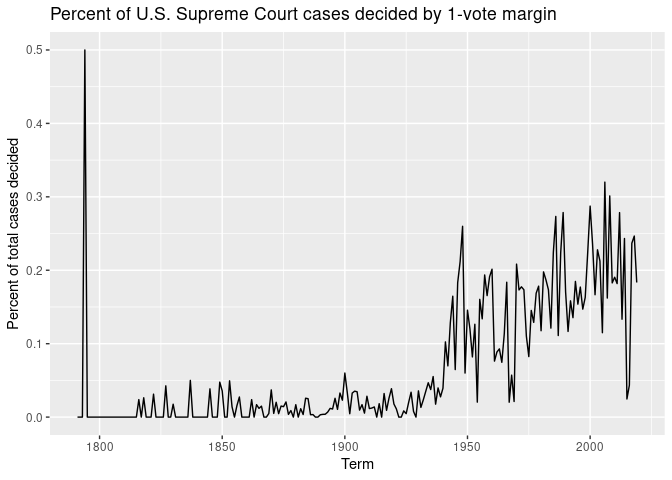
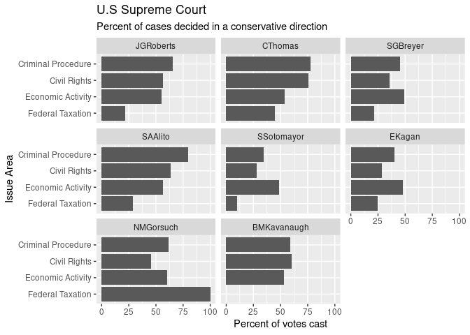
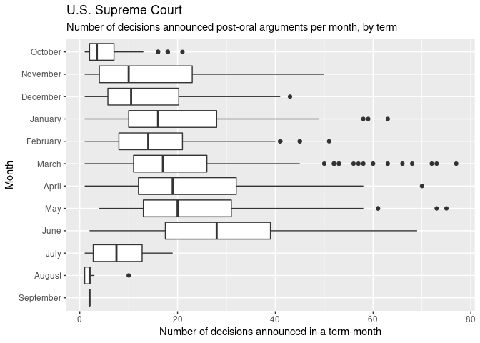
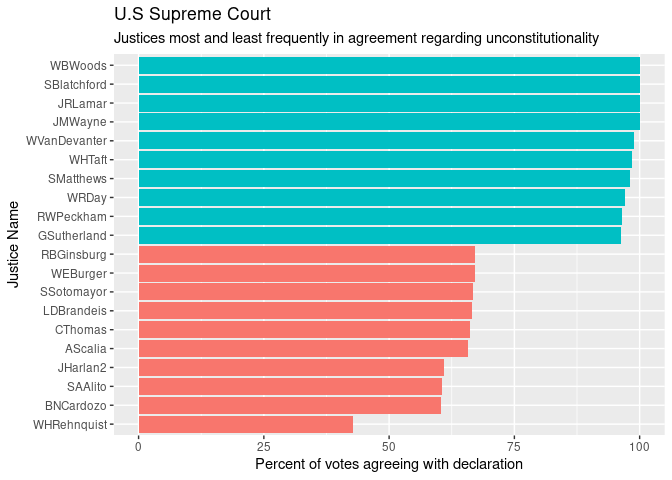
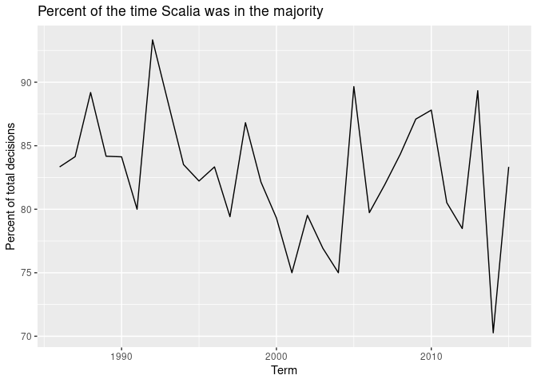
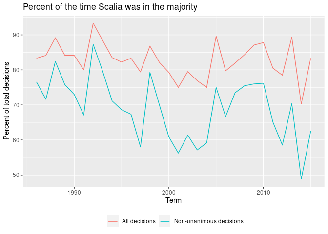
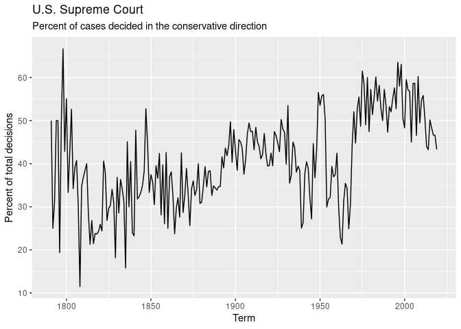

Exploring U.S. Supreme Court Decisions
================
Dylan Petiprin

## Get the data

``` r
# load useful packages
library(tidyverse)
```

    ## ── Attaching packages ─────────────────────────────────────── tidyverse 1.3.0 ──

    ## ✓ ggplot2 3.3.3     ✓ purrr   0.3.4
    ## ✓ tibble  3.0.4     ✓ dplyr   1.0.2
    ## ✓ tidyr   1.1.2     ✓ stringr 1.4.0
    ## ✓ readr   1.4.0     ✓ forcats 0.5.0

    ## ── Conflicts ────────────────────────────────────────── tidyverse_conflicts() ──
    ## x dplyr::filter() masks stats::filter()
    ## x dplyr::lag()    masks stats::lag()

``` r
# load data
setwd("~/CFSS Homework/hw03/hw03/data")
vote <- read_csv("scdb-vote.csv")
```

    ## 
    ## ── Column specification ────────────────────────────────────────────────────────
    ## cols(
    ##   caseId = col_character(),
    ##   docketId = col_character(),
    ##   caseIssuesId = col_character(),
    ##   voteId = col_character(),
    ##   term = col_double(),
    ##   justice = col_double(),
    ##   justiceName = col_character(),
    ##   vote = col_double(),
    ##   opinion = col_double(),
    ##   direction = col_double(),
    ##   majority = col_double(),
    ##   firstAgreement = col_double(),
    ##   secondAgreement = col_double()
    ## )

``` r
case <- read_csv("scdb-case.csv")
```

    ## 
    ## ── Column specification ────────────────────────────────────────────────────────
    ## cols(
    ##   .default = col_double(),
    ##   caseId = col_character(),
    ##   docketId = col_character(),
    ##   caseIssuesId = col_character(),
    ##   dateDecision = col_character(),
    ##   usCite = col_character(),
    ##   sctCite = col_logical(),
    ##   ledCite = col_character(),
    ##   lexisCite = col_character(),
    ##   chief = col_character(),
    ##   docket = col_logical(),
    ##   caseName = col_character(),
    ##   dateArgument = col_character(),
    ##   dateRearg = col_character(),
    ##   adminAction = col_logical(),
    ##   adminActionState = col_logical(),
    ##   lawMinor = col_character()
    ## )
    ## ℹ Use `spec()` for the full column specifications.

    ## Warning: 15270 parsing failures.
    ##   row     col           expected       actual            file
    ## 19887 sctCite 1/0/T/F/TRUE/FALSE 67 S. Ct. 6  'scdb-case.csv'
    ## 19887 docket  1/0/T/F/TRUE/FALSE 24           'scdb-case.csv'
    ## 19888 sctCite 1/0/T/F/TRUE/FALSE 67 S. Ct. 13 'scdb-case.csv'
    ## 19888 docket  1/0/T/F/TRUE/FALSE 12           'scdb-case.csv'
    ## 19889 sctCite 1/0/T/F/TRUE/FALSE 67 S. Ct. 1  'scdb-case.csv'
    ## ..... ....... .................. ............ ...............
    ## See problems(...) for more details.

## Recode variables as you find necessary

``` r
#nah
```

## What percentage of cases in each term are decided by a one-vote margin (i.e. 5-4, 4-3, etc.)

``` r
#Calculate the number of 1-vote margins per term

#create a list of one-vote proportions using summarise()
case %>% 
  group_by(term) %>% 
  select(c(term,majVotes,minVotes)) %>% 
  drop_na(minVotes) %>% 
  mutate(vote_diff = majVotes - minVotes) %>% 
  summarise(one_vote_perc = sum(vote_diff==1)/sum(term=n())) %>% 
  
#put into geom_line()
  ggplot(aes(term, one_vote_perc))+
  geom_line()+
  labs(title="Percent of U.S. Supreme Court cases decided by 1-vote margin",
       x="Term", y="Percent of total cases decided")
```

    ## `summarise()` ungrouping output (override with `.groups` argument)

<!-- -->

## For justices [currently serving on the Supreme Court](https://www.supremecourt.gov/about/biographies.aspx), how often have they voted in the conservative direction in cases involving criminal procedure, civil rights, economic activity, and federal taxation?

Organize the resulting graph by justice in descending order of
seniority. (Note that the chief justice is always considered the most
senior member of the court, regardless of appointment date.)

``` r
#calculate proportion of conservative votes by issue area
vote %>% 
    left_join(case, by = "caseId") %>% 
    select(justiceName, direction, issueArea) %>% 
  filter(justiceName %in% c("BMKavanaugh","NMGorsuch","EKagan","SSotomayor","SAAlito","SGBreyer","CThomas","JGRoberts")) %>% 
  filter(issueArea %in% c(1,2,8,12)) %>% 
    drop_na(direction) %>% 
  group_by(justiceName, issueArea) %>% 
  summarise(cons_perc = sum(direction == 1)/sum(justiceName = n())) %>% 
  
#Relabel issue areas in English and place justices by seniority
  mutate(issueArea = factor(issueArea, levels = c(12,8,2,1), 
       labels =c("Federal Taxation","Economic Activity","Civil Rights","Criminal Procedure"))) %>% 
  mutate(justiceName = factor(justiceName, levels = c("JGRoberts","CThomas","SGBreyer","SAAlito","SSotomayor","EKagan","NMGorsuch","BMKavanaugh"))) %>% 
  
#Plot using geom_col() and facet by justice
ggplot(aes(issueArea, cons_perc*100))+
  geom_col()+
  coord_flip()+
  facet_wrap(~justiceName)+
  labs(title= "U.S Supreme Court", subtitle="Percent of cases decided in a conservative direction", x="Issue Area",y="Percent of votes cast")
```

    ## `summarise()` regrouping output by 'justiceName' (override with `.groups` argument)

<!-- -->

## In each term, how many of the term’s published decisions (decided after oral arguments) were announced in a given month?

``` r
#Get decision totals by month, making sure to filter by post-oral arguments
case %>% 
      select(caseIssuesId,dateDecision, term, decisionType) %>% 
  filter(decisionType %in% c(1,6,7)) %>% 
  separate(dateDecision, into = c("Month","Day","Year")) %>% 
  mutate(Month = factor(Month, levels = c(9,8,7,6,5,4,3,2,1,12,11,10),labels = c("September","August","July","June","May","April","March","February","January","December","November","October"))) %>% 
  group_by(Month, term) %>%
 tally() %>% 
  
#Plot decision totals using geom_boxplot()
   ggplot(aes(Month,n))+
  geom_boxplot()+
  coord_flip()+
  labs(title = "U.S. Supreme Court", subtitle = "Number of decisions announced post-oral arguments per month, by term",
       y="Number of decisions announced in a term-month")
```

<!-- -->

## Which justices are most likely to agree with with the Court’s declaration that an act of Congress, a state or territorial law, or a municipal ordinance is unconstitutional? Identify all cases where the Court declared something unconstitutional and determine the ten justices who most and least frequently agreed with this outcome as a percentage of all votes cast by the justice in these cases. Exclude any justice with fewer than 30 votes in cases where the Court’s outcome declares something unconstitutional.

``` r
#Get all the instances of declared unconstitutionality and tally up each justice's votes
vote %>% 
  left_join(case, by = "caseIssuesId") %>% 
  select(declarationUncon, caseIssuesId, justiceName, majority) %>% 
  filter(declarationUncon!=1) %>% 
   group_by(justiceName, majority) %>% 
  drop_na(majority) %>%
  summarise(justice_total = n()) %>%
  pivot_wider(names_from = majority, values_from = justice_total) %>% 
  rename(dissent = 2, majority = 3) %>% 
  
#Calculate the percentage each justice agreed for unconstitutionality, filter out those with less than 30 total votes, and get the top and bottom 10
  mutate(dissent=replace_na(dissent,0), 
         justice_total = dissent + majority,
         justice_perc = majority / justice_total) %>% 
  filter(justice_total>30) %>% 
  arrange(justice_perc) %>% 
  ungroup() %>% 
  slice(1:10,69:78) %>% 
  
#Plot using geom_col()and color by top/bottom distinction
  ggplot(aes(x = reorder(justiceName, justice_perc),y = justice_perc*100))+
  geom_col(stat = "identity", aes(fill = justice_perc*100>75))+
  theme(legend.position = "none")+
  coord_flip()+
  labs(y="Percent of votes agreeing with declaration",
       x="Justice Name",
       title = "U.S Supreme Court",
       subtitle = "Justices most and least frequently in agreement regarding unconstitutionality")
```

    ## `summarise()` regrouping output by 'justiceName' (override with `.groups` argument)

    ## Warning: Ignoring unknown parameters: stat

<!-- -->

## In each term he served on the Court, in what percentage of cases was Justice Antonin Scalia in the majority?

``` r
#Calculate the percentage of Scalia in majority by term
vote %>% 
  left_join(case, by = "caseIssuesId") %>% 
  select(term.x, caseIssuesId, majority, justiceName, vote) %>% 
  filter(justiceName=="AScalia") %>% 
  drop_na(majority) %>% 
  group_by(term.x) %>% 

#Plot using geom_line()
summarise(AScal_maj_perc = sum(majority == 2)/sum(majority= n())) %>% 
  ggplot(aes(x=term.x, y=AScal_maj_perc*100))+
  geom_line()+
  labs(x = "Term", y = "Percent of total decisions", title= "Percent of the time Scalia was in the majority" )
```

    ## `summarise()` ungrouping output (override with `.groups` argument)

<!-- -->

## Create a graph similar to above that adds a second component which compares the percentage for all cases versus non-unanimous cases (i.e. there was at least one dissenting vote)

``` r
#Add another summarise() line to get the percentage for non-unanimous decisions
vote %>% 
  left_join(case, by = "caseIssuesId") %>% 
  select(term.x, caseIssuesId, majority, justiceName, vote, minVotes) %>% 
  filter(justiceName=="AScalia") %>% 
  drop_na(majority) %>% 
  group_by(term.x) %>% 
summarise(AScal_maj_perc = sum(majority == 2)/sum(majority= n()),
          AScal_nunan_maj_perc = sum(majority == 2 & minVotes != 0)/sum(minVotes != 0) ) %>% 

#Plot as before, distinguishing lines by color
  ggplot()+
  geom_line(aes(x=term.x, y=AScal_maj_perc*100, color = "All decisions"))+
              geom_line(aes(x=term.x, y=AScal_nunan_maj_perc*100, color = "Non-unanimous decisions")) +
  labs(x = "Term", y = "Percent of total decisions", title= "Percent of the time Scalia was in the majority", color= NULL )+
  theme(legend.position = "bottom")
```

    ## `summarise()` ungrouping output (override with `.groups` argument)

<!-- -->

## In each term, what percentage of cases were decided in the conservative direction?

``` r
#Calculate percentage of conservative cases by term
vote %>% 
  left_join(case, by = "caseIssuesId") %>% 
  select(term.x, caseIssuesId, decisionDirection) %>% 
  group_by(term.x) %>% 
  drop_na(decisionDirection) %>% 
  summarise(cons_perc = sum(decisionDirection == 1)/sum(decisionDirection = n())) %>% 
  
#Plot using geom_line()
  ggplot(aes(x=term.x, y=cons_perc*100))+
  geom_line()+
  labs(x = "Term", y = "Percent of total decisions", title= "U.S. Supreme Court", subtitle = "Percent of cases decided in the conservative direction" )
```

    ## `summarise()` ungrouping output (override with `.groups` argument)

<!-- -->

## The Chief Justice is frequently seen as capable of influencing the ideological direction of the Court. Create a graph similar to the one above that also incorporates information on who was the Chief Justice during the term.

``` r
#Retroactively create new dataframe without chief so that the later plots have that sweet, sweet gray background
vote_nochief <- vote %>% 
  left_join(case, by = "caseIssuesId") %>% 
  select(term.x, decisionDirection, caseIssuesId) %>% 
  group_by(term.x) %>% 
  drop_na(decisionDirection) %>% 
  summarise(cons_perc = sum(decisionDirection == 1)/sum(decisionDirection = n()))
```

    ## `summarise()` ungrouping output (override with `.groups` argument)

``` r
#Calculate percentage of conservative votes per chief tenure, and reorder by chief term
 vote %>% 
  left_join(case, by = "caseIssuesId") %>% 
  select(term.x, caseIssuesId, decisionDirection, chief) %>% 
  group_by(term.x, chief) %>% 
  drop_na(decisionDirection) %>% 
  summarise(cons_perc = sum(decisionDirection == 1)/sum(decisionDirection = n())) %>% 
  mutate(chief = fct_reorder(chief, term.x)) %>% 
   
#Plot using geom_line(), faceted by chief
  ggplot()+
  geom_line(aes(x=term.x, y=cons_perc*100)) +
  facet_wrap(~chief) +

#Add the background layer
   geom_line(data = vote_nochief, aes(x=term.x, y=cons_perc*100), alpha = .25) +
  labs(x = "Term", y = "Percent of total decisions", title= "U.S. Supreme Court", subtitle = "Percent of cases decided in the conservative direction" ) +
  scale_x_continuous(breaks = c(1800,1900,2000))
```

    ## `summarise()` regrouping output by 'term.x' (override with `.groups` argument)

<!-- -->

## Session info

``` r
devtools::session_info()
```

    ## ─ Session info ───────────────────────────────────────────────────────────────
    ##  setting  value                               
    ##  version  R version 4.0.1 (2020-06-06)        
    ##  os       Red Hat Enterprise Linux 8.3 (Ootpa)
    ##  system   x86_64, linux-gnu                   
    ##  ui       X11                                 
    ##  language (EN)                                
    ##  collate  en_US.UTF-8                         
    ##  ctype    en_US.UTF-8                         
    ##  tz       America/Chicago                     
    ##  date     2021-02-01                          
    ## 
    ## ─ Packages ───────────────────────────────────────────────────────────────────
    ##  package     * version date       lib source        
    ##  assertthat    0.2.1   2019-03-21 [2] CRAN (R 4.0.1)
    ##  backports     1.2.1   2020-12-09 [2] CRAN (R 4.0.1)
    ##  broom         0.7.3   2020-12-16 [2] CRAN (R 4.0.1)
    ##  callr         3.5.1   2020-10-13 [2] CRAN (R 4.0.1)
    ##  cellranger    1.1.0   2016-07-27 [2] CRAN (R 4.0.1)
    ##  cli           2.2.0   2020-11-20 [2] CRAN (R 4.0.1)
    ##  colorspace    2.0-0   2020-11-11 [2] CRAN (R 4.0.1)
    ##  crayon        1.3.4   2017-09-16 [2] CRAN (R 4.0.1)
    ##  DBI           1.1.0   2019-12-15 [2] CRAN (R 4.0.1)
    ##  dbplyr        2.0.0   2020-11-03 [2] CRAN (R 4.0.1)
    ##  desc          1.2.0   2018-05-01 [2] CRAN (R 4.0.1)
    ##  devtools      2.3.2   2020-09-18 [2] CRAN (R 4.0.1)
    ##  digest        0.6.27  2020-10-24 [2] CRAN (R 4.0.1)
    ##  dplyr       * 1.0.2   2020-08-18 [2] CRAN (R 4.0.1)
    ##  ellipsis      0.3.1   2020-05-15 [2] CRAN (R 4.0.1)
    ##  evaluate      0.14    2019-05-28 [2] CRAN (R 4.0.1)
    ##  fansi         0.4.1   2020-01-08 [2] CRAN (R 4.0.1)
    ##  farver        2.0.3   2020-01-16 [2] CRAN (R 4.0.1)
    ##  forcats     * 0.5.0   2020-03-01 [2] CRAN (R 4.0.1)
    ##  fs            1.5.0   2020-07-31 [2] CRAN (R 4.0.1)
    ##  generics      0.1.0   2020-10-31 [2] CRAN (R 4.0.1)
    ##  ggplot2     * 3.3.3   2020-12-30 [2] CRAN (R 4.0.1)
    ##  glue          1.4.2   2020-08-27 [2] CRAN (R 4.0.1)
    ##  gtable        0.3.0   2019-03-25 [2] CRAN (R 4.0.1)
    ##  haven         2.3.1   2020-06-01 [2] CRAN (R 4.0.1)
    ##  hms           0.5.3   2020-01-08 [2] CRAN (R 4.0.1)
    ##  htmltools     0.4.0   2019-10-04 [2] CRAN (R 4.0.1)
    ##  httr          1.4.2   2020-07-20 [2] CRAN (R 4.0.1)
    ##  jsonlite      1.7.2   2020-12-09 [2] CRAN (R 4.0.1)
    ##  knitr         1.30    2020-09-22 [2] CRAN (R 4.0.1)
    ##  labeling      0.4.2   2020-10-20 [2] CRAN (R 4.0.1)
    ##  lifecycle     0.2.0   2020-03-06 [2] CRAN (R 4.0.1)
    ##  lubridate     1.7.9.2 2020-11-13 [2] CRAN (R 4.0.1)
    ##  magrittr      2.0.1   2020-11-17 [2] CRAN (R 4.0.1)
    ##  memoise       1.1.0   2017-04-21 [2] CRAN (R 4.0.1)
    ##  modelr        0.1.8   2020-05-19 [2] CRAN (R 4.0.1)
    ##  munsell       0.5.0   2018-06-12 [2] CRAN (R 4.0.1)
    ##  pillar        1.4.7   2020-11-20 [2] CRAN (R 4.0.1)
    ##  pkgbuild      1.2.0   2020-12-15 [2] CRAN (R 4.0.1)
    ##  pkgconfig     2.0.3   2019-09-22 [2] CRAN (R 4.0.1)
    ##  pkgload       1.1.0   2020-05-29 [2] CRAN (R 4.0.1)
    ##  prettyunits   1.1.1   2020-01-24 [2] CRAN (R 4.0.1)
    ##  processx      3.4.5   2020-11-30 [2] CRAN (R 4.0.1)
    ##  ps            1.5.0   2020-12-05 [2] CRAN (R 4.0.1)
    ##  purrr       * 0.3.4   2020-04-17 [2] CRAN (R 4.0.1)
    ##  R6            2.5.0   2020-10-28 [2] CRAN (R 4.0.1)
    ##  Rcpp          1.0.5   2020-07-06 [2] CRAN (R 4.0.1)
    ##  readr       * 1.4.0   2020-10-05 [2] CRAN (R 4.0.1)
    ##  readxl        1.3.1   2019-03-13 [2] CRAN (R 4.0.1)
    ##  remotes       2.2.0   2020-07-21 [2] CRAN (R 4.0.1)
    ##  reprex        0.3.0   2019-05-16 [2] CRAN (R 4.0.1)
    ##  rlang         0.4.10  2020-12-30 [2] CRAN (R 4.0.1)
    ##  rmarkdown     2.6     2020-12-14 [2] CRAN (R 4.0.1)
    ##  rprojroot     2.0.2   2020-11-15 [2] CRAN (R 4.0.1)
    ##  rstudioapi    0.13    2020-11-12 [2] CRAN (R 4.0.1)
    ##  rvest         0.3.6   2020-07-25 [2] CRAN (R 4.0.1)
    ##  scales        1.1.1   2020-05-11 [2] CRAN (R 4.0.1)
    ##  sessioninfo   1.1.1   2018-11-05 [2] CRAN (R 4.0.1)
    ##  stringi       1.5.3   2020-09-09 [2] CRAN (R 4.0.1)
    ##  stringr     * 1.4.0   2019-02-10 [2] CRAN (R 4.0.1)
    ##  testthat      3.0.1   2020-12-17 [2] CRAN (R 4.0.1)
    ##  tibble      * 3.0.4   2020-10-12 [2] CRAN (R 4.0.1)
    ##  tidyr       * 1.1.2   2020-08-27 [2] CRAN (R 4.0.1)
    ##  tidyselect    1.1.0   2020-05-11 [2] CRAN (R 4.0.1)
    ##  tidyverse   * 1.3.0   2019-11-21 [2] CRAN (R 4.0.1)
    ##  usethis       2.0.0   2020-12-10 [1] CRAN (R 4.0.1)
    ##  vctrs         0.3.6   2020-12-17 [2] CRAN (R 4.0.1)
    ##  withr         2.3.0   2020-09-22 [2] CRAN (R 4.0.1)
    ##  xfun          0.19    2020-10-30 [2] CRAN (R 4.0.1)
    ##  xml2          1.3.2   2020-04-23 [2] CRAN (R 4.0.1)
    ##  yaml          2.2.1   2020-02-01 [2] CRAN (R 4.0.1)
    ## 
    ## [1] /home/dylanbpetiprin/R/x86_64-pc-linux-gnu-library/4.0
    ## [2] /opt/R/4.0.1/lib/R/library
