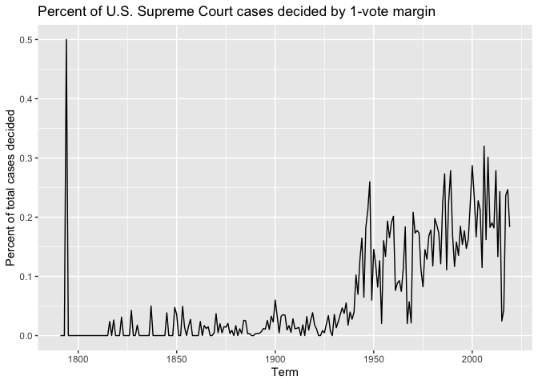
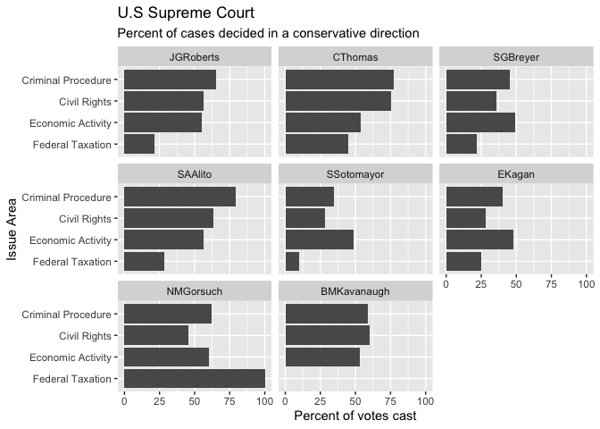
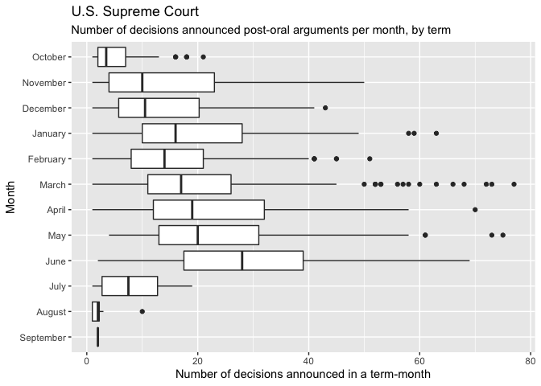
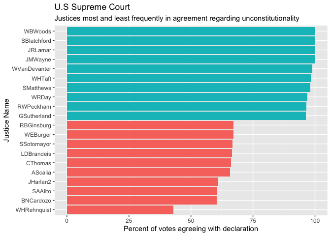
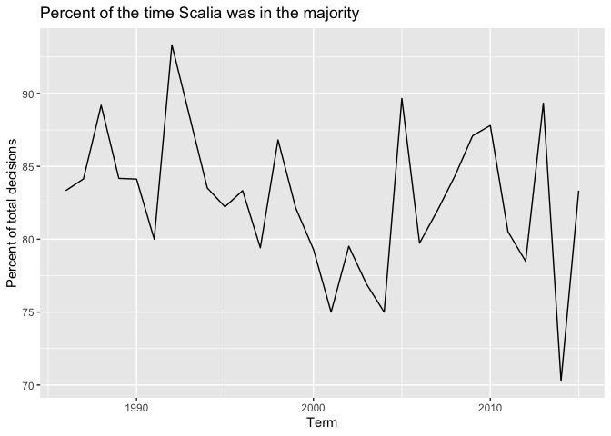
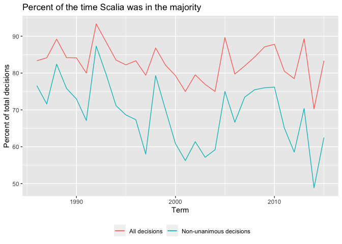
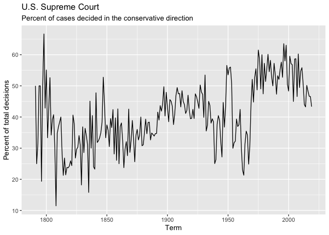
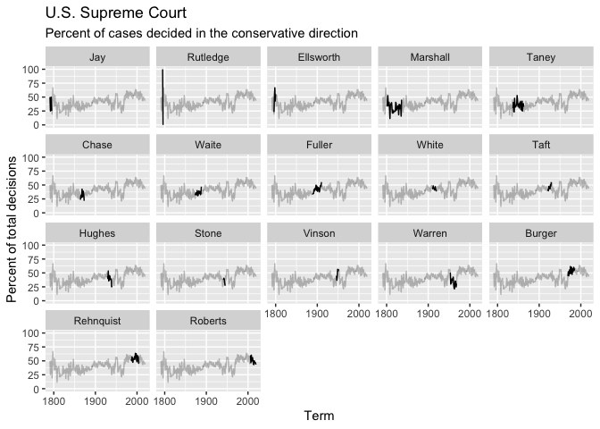

```r
# load useful packages
library(tidyverse)
```

```
## ── Attaching packages ─────────────────────────────────────── tidyverse 1.3.1 ──
```

```
## ✓ ggplot2 3.3.5     ✓ purrr   0.3.4
## ✓ tibble  3.1.2     ✓ dplyr   1.0.7
## ✓ tidyr   1.1.3     ✓ stringr 1.4.0
## ✓ readr   1.4.0     ✓ forcats 0.5.1
```

```
## ── Conflicts ────────────────────────────────────────── tidyverse_conflicts() ──
## x dplyr::filter() masks stats::filter()
## x dplyr::lag()    masks stats::lag()
```

```r
library(here)
```

```
## here() starts at /Users/dylan/OneDrive/Documents/job apps/Questbridge
```

```r
# load data
setwd(here("R_files", "scotus_project", "data"))
vote <- read_csv("scdb-vote.csv")
```

```
## 
## ── Column specification ────────────────────────────────────────────────────────
## cols(
##   caseId = col_character(),
##   docketId = col_character(),
##   caseIssuesId = col_character(),
##   voteId = col_character(),
##   term = col_double(),
##   justice = col_double(),
##   justiceName = col_character(),
##   vote = col_double(),
##   opinion = col_double(),
##   direction = col_double(),
##   majority = col_double(),
##   firstAgreement = col_double(),
##   secondAgreement = col_double()
## )
```

```r
case <- read_csv("scdb-case.csv")
```

```
## 
## ── Column specification ────────────────────────────────────────────────────────
## cols(
##   .default = col_double(),
##   caseId = col_character(),
##   docketId = col_character(),
##   caseIssuesId = col_character(),
##   dateDecision = col_character(),
##   usCite = col_character(),
##   sctCite = col_logical(),
##   ledCite = col_character(),
##   lexisCite = col_character(),
##   chief = col_character(),
##   docket = col_logical(),
##   caseName = col_character(),
##   dateArgument = col_character(),
##   dateRearg = col_character(),
##   adminAction = col_logical(),
##   adminActionState = col_logical(),
##   lawMinor = col_character()
## )
## ℹ Use `spec()` for the full column specifications.
```

```
## Warning: 15270 parsing failures.
##   row     col           expected       actual            file
## 19887 sctCite 1/0/T/F/TRUE/FALSE 67 S. Ct. 6  'scdb-case.csv'
## 19887 docket  1/0/T/F/TRUE/FALSE 24           'scdb-case.csv'
## 19888 sctCite 1/0/T/F/TRUE/FALSE 67 S. Ct. 13 'scdb-case.csv'
## 19888 docket  1/0/T/F/TRUE/FALSE 12           'scdb-case.csv'
## 19889 sctCite 1/0/T/F/TRUE/FALSE 67 S. Ct. 1  'scdb-case.csv'
## ..... ....... .................. ............ ...............
## See problems(...) for more details.
```


## Question 1

### What percentage of cases in each term are decided by a one-vote margin (i.e. 5-4, 4-3, etc.)

```r
# Calculate the number of 1-vote margins per term

# create a list of one-vote proportions using summarise()
case %>% 
  group_by(term) %>% 
  select(c(term,majVotes,minVotes)) %>% 
  drop_na(minVotes) %>% 
  mutate(vote_diff = majVotes - minVotes) %>% 
  summarise(one_vote_perc = sum(vote_diff==1)/sum(term=n())) %>% 
  
# put into geom_line()
  ggplot(aes(term, one_vote_perc))+
  geom_line()+
  labs(title="Percent of U.S. Supreme Court cases decided by 1-vote margin",
       x="Term", y="Percent of total cases decided")
```

<!-- -->

## Question 2

### For justices [currently serving on the Supreme Court](https://www.supremecourt.gov/about/biographies.aspx), how often have they voted in the conservative direction in cases involving criminal procedure, civil rights, economic activity, and federal taxation?


```r
# calculate proportion of conservative votes by issue area
vote %>% 
    left_join(case, by = "caseId") %>% 
    select(justiceName, direction, issueArea) %>% 
  filter(justiceName %in% c("BMKavanaugh","NMGorsuch","EKagan","SSotomayor","SAAlito","SGBreyer","CThomas","JGRoberts")) %>% 
  filter(issueArea %in% c(1,2,8,12)) %>% 
    drop_na(direction) %>% 
  group_by(justiceName, issueArea) %>% 
  summarise(cons_perc = sum(direction == 1)/sum(justiceName = n())) %>% 
  
# relabel issue areas in English and place justices by seniority
  mutate(issueArea = factor(issueArea, levels = c(12,8,2,1), 
       labels =c("Federal Taxation","Economic Activity","Civil Rights","Criminal Procedure"))) %>% 
  mutate(justiceName = factor(justiceName, levels = c("JGRoberts","CThomas","SGBreyer","SAAlito","SSotomayor","EKagan","NMGorsuch","BMKavanaugh"))) %>% 
  
# plot using geom_col() and facet by justice
ggplot(aes(issueArea, cons_perc*100))+
  geom_col()+
  coord_flip()+
  facet_wrap(~justiceName)+
  labs(title= "U.S Supreme Court", subtitle="Percent of cases decided in a conservative direction", x="Issue Area",y="Percent of votes cast")
```

```
## `summarise()` has grouped output by 'justiceName'. You can override using the `.groups` argument.
```

<!-- -->

## Question 3

### In each term, how many of the term's published decisions (decided after oral arguments) were announced in a given month?


```r
# get decision totals by month, making sure to filter by post-oral arguments
case %>% 
      select(caseIssuesId,dateDecision, term, decisionType) %>% 
  filter(decisionType %in% c(1,6,7)) %>% 
  separate(dateDecision, into = c("Month","Day","Year")) %>% 
  mutate(Month = factor(Month, levels = c(9,8,7,6,5,4,3,2,1,12,11,10),labels = c("September","August","July","June","May","April","March","February","January","December","November","October"))) %>% 
  group_by(Month, term) %>%
 tally() %>% 
  
# plot decision totals using geom_boxplot()
   ggplot(aes(Month,n))+
  geom_boxplot()+
  coord_flip()+
  labs(title = "U.S. Supreme Court", subtitle = "Number of decisions announced post-oral arguments per month, by term",
       y="Number of decisions announced in a term-month")
```

<!-- -->

## Question 4

### Which justices are most likely to agree with with the Court's declaration that an act of Congress, a state or territorial law, or a municipal ordinance is unconstitutional? Identify all cases where the Court declared something unconstitutional and determine the ten justices who most and least frequently agreed with this outcome as a percentage of all votes cast by the justice in these cases. Exclude any justice with fewer than 30 votes in cases where the Court's outcome declares something unconstitutional.


```r
# get all the instances of declared unconstitutionality and tally up each justice's votes
vote %>% 
  left_join(case, by = "caseIssuesId") %>% 
  select(declarationUncon, caseIssuesId, justiceName, majority) %>% 
  filter(declarationUncon!=1) %>% 
   group_by(justiceName, majority) %>% 
  drop_na(majority) %>%
  summarise(justice_total = n()) %>%
  pivot_wider(names_from = majority, values_from = justice_total) %>% 
  rename(dissent = 2, majority = 3) %>% 
  
# calculate the percentage each justice agreed for unconstitutionality, filter out those with less than 30 total votes, and get the top and bottom 10
  mutate(dissent=replace_na(dissent,0), 
         justice_total = dissent + majority,
         justice_perc = majority / justice_total) %>% 
  filter(justice_total>30) %>% 
  arrange(justice_perc) %>% 
  ungroup() %>% 
  slice(1:10,69:78) %>% 
  
# plot using geom_col()and color by top/bottom distinction
  ggplot(aes(x = reorder(justiceName, justice_perc),y = justice_perc*100))+
  geom_col(stat = "identity", aes(fill = justice_perc*100>75))+
  theme(legend.position = "none")+
  coord_flip()+
  labs(y="Percent of votes agreeing with declaration",
       x="Justice Name",
       title = "U.S Supreme Court",
       subtitle = "Justices most and least frequently in agreement regarding unconstitutionality")
```

```
## `summarise()` has grouped output by 'justiceName'. You can override using the `.groups` argument.
```

```
## Warning: Ignoring unknown parameters: stat
```

<!-- -->

## Question 5

### In each term he served on the Court, in what percentage of cases was Justice Antonin Scalia in the majority?


```r
# calculate the percentage of Scalia in majority by term
vote %>% 
  left_join(case, by = "caseIssuesId") %>% 
  select(term.x, caseIssuesId, majority, justiceName, vote) %>% 
  filter(justiceName=="AScalia") %>% 
  drop_na(majority) %>% 
  group_by(term.x) %>% 

# plot using geom_line()
summarise(AScal_maj_perc = sum(majority == 2)/sum(majority= n())) %>% 
  ggplot(aes(x=term.x, y=AScal_maj_perc*100))+
  geom_line()+
  labs(x = "Term", y = "Percent of total decisions", title= "Percent of the time Scalia was in the majority" )
```

<!-- -->

## Question 6

### Create a graph similar to above that adds a second component which compares the percentage for all cases versus non-unanimous cases (i.e. there was at least one dissenting vote)


```r
# add another summarise() line to get the percentage for non-unanimous decisions
vote %>% 
  left_join(case, by = "caseIssuesId") %>% 
  select(term.x, caseIssuesId, majority, justiceName, vote, minVotes) %>% 
  filter(justiceName=="AScalia") %>% 
  drop_na(majority) %>% 
  group_by(term.x) %>% 
summarise(AScal_maj_perc = sum(majority == 2)/sum(majority= n()),
          AScal_nunan_maj_perc = sum(majority == 2 & minVotes != 0)/sum(minVotes != 0) ) %>% 

# plot as before, distinguishing lines by color
  ggplot()+
  geom_line(aes(x=term.x, y=AScal_maj_perc*100, color = "All decisions"))+
              geom_line(aes(x=term.x, y=AScal_nunan_maj_perc*100, color = "Non-unanimous decisions")) +
  labs(x = "Term", y = "Percent of total decisions", title= "Percent of the time Scalia was in the majority", color= NULL )+
  theme(legend.position = "bottom")
```

<!-- -->

## Question 7

### In each term, what percentage of cases were decided in the conservative direction?


```r
# calculate percentage of conservative cases by term
vote %>% 
  left_join(case, by = "caseIssuesId") %>% 
  select(term.x, caseIssuesId, decisionDirection) %>% 
  group_by(term.x) %>% 
  drop_na(decisionDirection) %>% 
  summarise(cons_perc = sum(decisionDirection == 1)/sum(decisionDirection = n())) %>% 
  
# plot using geom_line()
  ggplot(aes(x=term.x, y=cons_perc*100))+
  geom_line()+
  labs(x = "Term", y = "Percent of total decisions", title= "U.S. Supreme Court", subtitle = "Percent of cases decided in the conservative direction" )
```

<!-- -->

## Question 8

### The Chief Justice is frequently seen as capable of influencing the ideological direction of the Court. Create a graph similar to the one above that also incorporates information on who was the Chief Justice during the term.


```r
# retroactively create new dataframe without chief so that the later plots have gray background
vote_nochief <- vote %>% 
  left_join(case, by = "caseIssuesId") %>% 
  select(term.x, decisionDirection, caseIssuesId) %>% 
  group_by(term.x) %>% 
  drop_na(decisionDirection) %>% 
  summarise(cons_perc = sum(decisionDirection == 1)/sum(decisionDirection = n()))

# calculate percentage of conservative votes per chief tenure, and reorder by chief term
 vote %>% 
  left_join(case, by = "caseIssuesId") %>% 
  select(term.x, caseIssuesId, decisionDirection, chief) %>% 
  group_by(term.x, chief) %>% 
  drop_na(decisionDirection) %>% 
  summarise(cons_perc = sum(decisionDirection == 1)/sum(decisionDirection = n())) %>% 
  mutate(chief = fct_reorder(chief, term.x)) %>% 
   
# plot using geom_line(), faceted by chief
  ggplot()+
  geom_line(aes(x=term.x, y=cons_perc*100)) +
  facet_wrap(~chief) +

# add layer to background 
   geom_line(data = vote_nochief, aes(x=term.x, y=cons_perc*100), alpha = .25) +
  labs(x = "Term", y = "Percent of total decisions", title= "U.S. Supreme Court", subtitle = "Percent of cases decided in the conservative direction" ) +
  scale_x_continuous(breaks = c(1800,1900,2000))
```

```
## `summarise()` has grouped output by 'term.x'. You can override using the `.groups` argument.
```

<!-- -->


